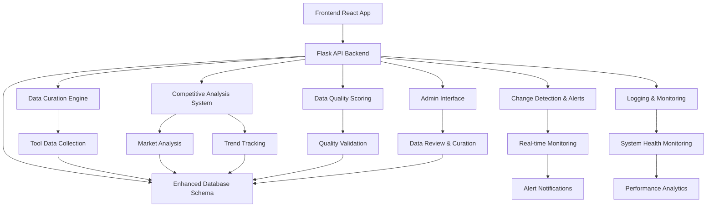

# AI Tool Intelligence Platform - Complete Application Workflow

## 🏗️ **Architecture Overview**

The AI Tool Intelligence Platform is now a **comprehensive competitive intelligence system** that integrates multiple subsystems for automated monitoring, analysis, and alerting of AI developer tools.

### **Core Application Flow**



## 🚀 **Application Startup Process**

### **1. Main Application Entry Point**
```bash
python backend/app.py
```

### **2. System Initialization Sequence**

1. **AWS Credential Validation** (if not skipped)
   - Validates AWS credentials for Bedrock/Claude access
   - Ensures Claude 3.5 Sonnet model availability

2. **Enhanced System Loading**
   - Imports all competitive intelligence modules
   - Initializes: Market Analyzer, Trend Tracker, Alert Manager, Quality Scorer
   - Loads Admin Interface and Monitoring Dashboard
   - Sets up comprehensive logging system

3. **Database Schema Setup**
   - Creates basic Flask tables
   - **Runs enhanced schema migration** if available
   - Initializes competitive intelligence tables

4. **System Integration**
   - Sets up curation hooks for automatic competitive analysis
   - Configures batch monitoring integration
   - Initializes real-time monitoring (if enabled)
   - Registers admin and monitoring API blueprints
   - Starts performance tracking and logging

5. **API Server Start**
   - Flask server starts on `http://localhost:5000`
   - Frontend serves from `http://localhost:3000`

## 🔄 **Complete Workflow Examples**

### **Workflow 1: Tool Research & Competitive Analysis**

```
1. User adds new tool via Frontend
   ↓
2. POST /api/tools (creates basic tool record)
   ↓
3. User triggers research: POST /api/tools/{id}/curate
   ↓
4. Enhanced Curation Process:
   - Strands Agent researches tool
   - Data quality scoring
   - Change detection
   - Competitive analysis trigger
   ↓
5. Automatic Competitive Analysis:
   - Category competition analysis
   - Market positioning calculation
   - Trend impact assessment
   ↓
6. Alert Generation (if significant):
   - Email/Slack notifications
   - Database alerts
   - Real-time updates
```

### **Workflow 2: Market Intelligence Dashboard**

```
1. User views competitive dashboard
   ↓
2. Frontend calls multiple APIs:
   - GET /api/categories/{id}/competitive-analysis
   - GET /api/market/trends?type=features&days=90
   - GET /api/market/forecast?horizon_days=90
   ↓
3. Backend processes:
   - Market Analyzer generates competitive metrics
   - Trend Tracker analyzes adoption patterns
   - Forecasting engine predicts market changes
   ↓
4. Real-time data presentation:
   - Market leaders ranking
   - Trend visualizations
   - Opportunity identification
```

### **Workflow 3: Continuous Monitoring**

```
1. Real-time Monitoring Loop (every 30 minutes):
   ↓
2. Change Detection:
   - Scans for new tool changes
   - Identifies significant modifications
   ↓
3. Automatic Analysis:
   - Triggers competitive analysis for affected categories
   - Updates trend calculations
   - Recalculates market positions
   ↓
4. Alert Processing:
   - Generates alerts for critical changes
   - Sends notifications via configured channels
   - Updates dashboard data
```

## 📡 **API Integration Points**

### **Enhanced Competitive Intelligence APIs**

| Endpoint | Purpose | Integration |
|----------|---------|-------------|
| `POST /api/tools/{id}/curate` | Enhanced tool curation | Replaces basic research |
| `GET /api/categories/{id}/competitive-analysis` | Category competition | Dashboard integration |
| `GET /api/market/trends` | Market trend analysis | Trend dashboard |
| `GET /api/market/forecast` | Market forecasting | Strategy planning |
| `GET /api/competitive/digest` | Daily/weekly digests | Executive reporting |
| `POST /api/competitive/compare` | Tool comparison | Feature comparison |
| `GET /api/market/opportunities` | Opportunity detection | Strategic planning |
| `GET /api/tools/{id}/quality-score` | Data quality metrics | Data validation |
| `GET /api/system/status` | System health check | Monitoring dashboard |

### **Admin Interface APIs**

| Endpoint | Purpose | Integration |
|----------|---------|-------------|
| `GET /api/admin/dashboard` | Admin dashboard data | Admin console |
| `POST /api/admin/tools/{id}/review` | Data review workflow | Quality management |
| `POST /api/admin/bulk-operations` | Bulk data operations | Mass management |
| `GET /api/admin/alert-rules` | Alert rule management | Notification config |
| `POST /api/admin/export` | Data export capabilities | Analytics export |
| `GET /api/admin/analytics` | System analytics | Performance insights |
| `GET /api/admin/system/health` | System health status | Operations monitoring |

### **Monitoring & Logging APIs**

| Endpoint | Purpose | Integration |
|----------|---------|-------------|
| `GET /api/monitoring/health` | System health status | Health dashboard |
| `GET /api/monitoring/metrics` | Performance metrics | Monitoring console |
| `GET /api/monitoring/logs` | System logs access | Log analysis |
| `GET /api/monitoring/performance` | Performance analytics | Optimization insights |
| `GET /api/monitoring/alerts` | System alerts | Alert management |
| `POST /api/monitoring/start` | Start monitoring | System control |
| `POST /api/monitoring/stop` | Stop monitoring | System control |

### **Data Flow Integration**

```
Frontend Components → API Endpoints → Enhanced System Manager → Specialized Engines
                                            ↓                        ↓
                                    Admin Interface              Monitoring Dashboard
                                            ↓                        ↓
Database ← Change Detection ← Competitive Analysis ← Data Curation   System Logger
    ↓                                                                    ↓
Alert System → Notification Channels (Email, Slack, Webhooks)    Log Files & Analytics
```

## 🎯 **Key Integration Features**

### **1. Automatic Competitive Triggers**

When a tool is curated/researched:
- **Automatic category analysis** if significant changes detected
- **Market position recalculation** for affected tools
- **Trend impact assessment** for feature changes
- **Alert generation** for critical market shifts

### **2. Real-time Monitoring Integration**

Background processes:
- **Incremental analysis** every 30 minutes
- **Trend breakout detection** 
- **Market shift alerts**
- **Data quality monitoring**

### **3. Scheduled Intelligence Reports**

Automated reporting:
- **Daily competitive digests** (6 AM)
- **Weekly opportunity analysis** (Monday 8 AM)
- **Monthly intelligence reports** (1st of month)
- **Hourly trend monitoring**

### **4. Enterprise Admin Capabilities**

Admin interface features:
- **Data review workflows** with approval/rejection
- **Bulk operations** for mass data management
- **Quality monitoring** and validation
- **System analytics** and performance tracking
- **Alert rule management** and configuration
- **Data export** in multiple formats (JSON, CSV, Excel)

### **5. Comprehensive Monitoring**

Real-time monitoring:
- **System health** assessment and component status
- **Performance metrics** collection and analysis
- **Error tracking** and issue identification
- **Resource utilization** monitoring
- **Audit logging** for compliance and security

### **6. Fallback Behavior**

If enhanced features unavailable:
- **Graceful degradation** to basic functionality
- **Clear error messaging** about missing features
- **Basic tool research** still available

## 🔧 **Environment Configuration**

### **Required Environment Variables**

```bash
# Database
DATABASE_URL=sqlite:///ai_tools.db

# AWS (for Strands Agent research)
AWS_REGION=us-east-1
AWS_ACCESS_KEY_ID=your_key
AWS_SECRET_ACCESS_KEY=your_secret

# Enhanced Features Control
ENABLE_REAL_TIME_MONITORING=true
ENHANCED_FEATURES_ENABLED=true

# Alert System
SMTP_SERVER=smtp.gmail.com
SMTP_USERNAME=your_email@gmail.com
SMTP_PASSWORD=your_app_password
SLACK_WEBHOOK_URL=https://hooks.slack.com/...
```

### **Feature Toggles**

```bash
# Skip AWS validation for development
SKIP_AWS_VALIDATION=1

# Disable enhanced features if needed
ENHANCED_FEATURES_ENABLED=false

# Control monitoring
ENABLE_REAL_TIME_MONITORING=false
```

## 📊 **Dashboard Integration**

### **Frontend Integration Points**

The React frontend now integrates with:

1. **Competitive Analysis Widgets**
   - Market leaders display
   - Trend visualizations  
   - Competitive positioning charts

2. **Tool Detail Enhancements**
   - Quality scores
   - Competitive metrics
   - Market position indicators

3. **Intelligence Dashboard**
   - Real-time market insights
   - Trend breakout alerts
   - Opportunity identification

4. **Alert Management**
   - Alert history view
   - Notification preferences
   - Digest subscriptions

## 🛠️ **Command Line Operations**

### **CLI Tools Available**

```bash
# Competitive Analysis CLI
python competitive_analysis/competitive_cli.py analyze-category 1
python competitive_analysis/competitive_cli.py track-trends --type features
python competitive_analysis/competitive_cli.py generate-forecast

# Alert Management CLI  
python change_detection/alert_cli.py test-channels
python change_detection/alert_cli.py monitor --interval 10

# Data Quality CLI
python data_validation/quality_cli.py assess-tool 1
python data_validation/quality_cli.py generate-report
```

## 🎉 **Complete Application Capabilities**

### **What Users Can Now Do**

1. **📊 Comprehensive Tool Research**
   - Enhanced AI-powered data collection
   - Automatic competitive positioning
   - Quality scoring and validation

2. **🏆 Market Intelligence**
   - Real-time competitive analysis
   - Market leader identification
   - Trend tracking and forecasting

3. **⚡ Automated Monitoring**
   - Continuous change detection
   - Intelligent alert routing
   - Breakout trend identification

4. **📈 Strategic Planning**
   - Market opportunity detection
   - Competitive gap analysis
   - Strategic recommendations

5. **📧 Smart Notifications**
   - Multi-channel alerting
   - Intelligent digest reports
   - Configurable alert rules

### **Value Proposition**

The AI Tool Intelligence Platform now provides:
- **360° competitive visibility** into the AI tools market
- **Automated intelligence gathering** with minimal manual effort
- **Predictive insights** for strategic decision making
- **Real-time awareness** of market changes and opportunities

---

## 🚀 **Getting Started**

1. **Start the application**: `python backend/app.py`
2. **Check system status**: `GET /api/system/status`
3. **Add tools and trigger curation**: Use enhanced `/api/tools/{id}/curate`
4. **Access competitive intelligence**: Via new API endpoints
5. **Monitor alerts**: Check configured notification channels

The platform now operates as a **comprehensive competitive intelligence system** that automatically monitors, analyzes, and alerts on the AI developer tools market! 🎯